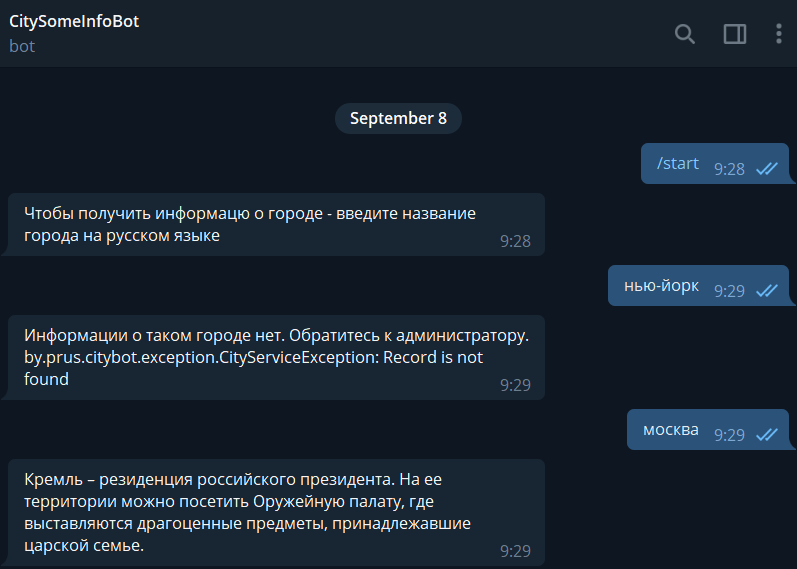

The project represent Telegram bot that gives information about city with regards to user's request. 

In order to start bot - need to use following information. 

- bot name = @CitySomeInfoBot
- bot token = 1857716830:AAF5YcNnJ4L0iwOJaJByvhLLFPYLqKCQBUs

Information for Administrator

The request creating new City id
 
URL
http://localhost:8080/t.me/CitySomeInfoBot/cities

Request - POST

example: 
{
    "name":"Minsk",
    "info":"Capital of Belarus"
}

Update of cities' information the same. Just Request - PUT instead of POST.

In order to delete city - administrator need to know ID of current record in DB

